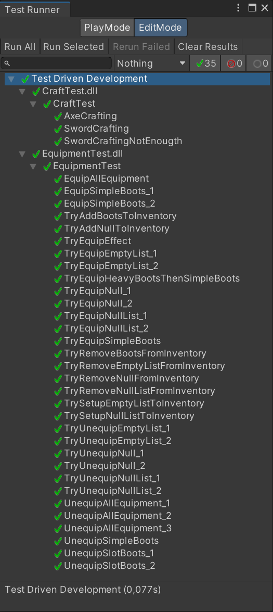

# Test Driven Development (TDD)

### Описание
В проекте был использован подход "Разработка через тестирование". Написаны тесты для крафта предметов из инвентаря и для системы экипировки предметов.

### Что такое TDD
Разработка через тестирование — это методология итеративной разработки программного обеспечения, в которой тесты пишутся перед написанием кода. Основная идея заключается в том, чтобы писать тесты, которые описывают желаемое поведение программы, а затем создавать код, который удовлетворяет этим тестам.

### Скриншоты

